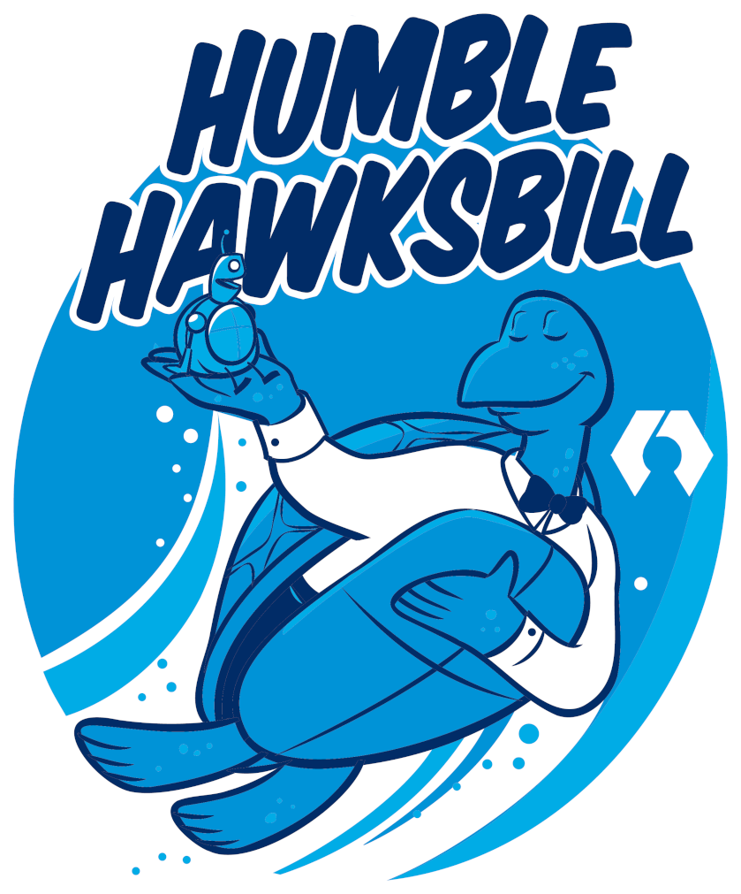
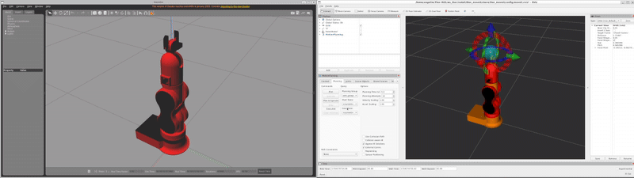
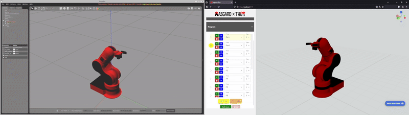

<h1 align="center">
 <a href="http://thor.angel-lm.com">
    <picture>
      <source height="80" media="(prefers-color-scheme: dark)" srcset="Docs/Media/THORxROS_dark.svg">
      
    </picture>
  </a>
</h1>

  <em>This repository brings together all the <b>ROS2 packages</b> required to control the <b><a href="https://github.com/angellm/thor">Thor robotic arm</a></b> using <b>ROS2 Humble</b> and <b>MoveIt2</b>.  
  It also includes <b>Asgard</b>, a modern web-based graphical interface built with <b>React</b> to make operating and programming the arm intuitive and accessible.</em>

  
  
  

## 📦 What’s inside this repository?

- `ws_thor/src` - **ROS2 Packages for Thor**  
  All packages and configuration needed to integrate Thor with ROS2 Humble LTS and MoveIt2, enabling motion planning, simulation, and control via RViz.  
  You can also simulate the real robot in Gazebo—perfect for testing before moving to the actual hardware, or if you don’t have a Thor robot yet!
  

  
  

- `/asgard` - **Asgard: Web GUI**  
  **Asgard** is a React-based web application for visual and intuitive control and programming of the Thor arm. No need for command-line interaction!  
  It provides an environment where you can control the robot using joint movements (forward kinematics) or target coordinates (inverse kinematics)—in a way similar to RViz.  
  You can save poses, create and execute programs by choosing joint or linear movements for each pose.
  

  
  

## 🚀 Quick Start

### For the Hardcore Penguins: Ubuntu 22.04

Are you a fearless Linux fan who believes 
real robots should run free and native?  
If you think installing software is best done with a terminal, some caffeine, and a dash of adventure, this is your path!  
Summon the full power of Thor on Ubuntu 22.04 and let the penguin spirit guide your robotic journey.  
👉 [See instructions for Ubuntu 22.04](ubuntu-instructions.md)

### For the Windows Adventurers: Windows 11 + WSL2

Are you a brave explorer who likes the comfort of Windows but secretly wants to play in the Linux playground?  
With Windows 11 + WSL2, you can have the best of both worlds.  
No need to dual boot, invoke dark powers, or sacrifice a USB stick. Just open your terminal, let WSL2 work its magic, and enjoy robotic domination with minimum fuss and maximum style!  
👉 [See instructions for Windows 11 + WSL2](windows-instructions.md)

## 🤝 Join the Community

Want to contribute or need help?  
Join our [Thor Robot Discord Community](https://discord.com/invite/a5dSVqSUK5) to collaborate and help improve the Thor-ROS project.